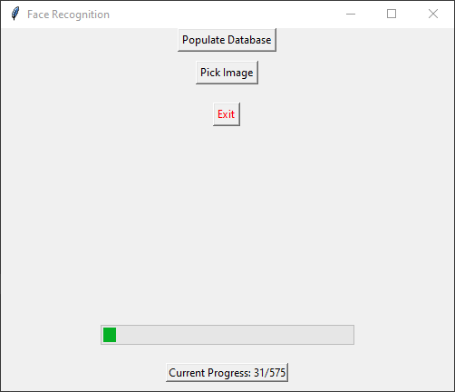
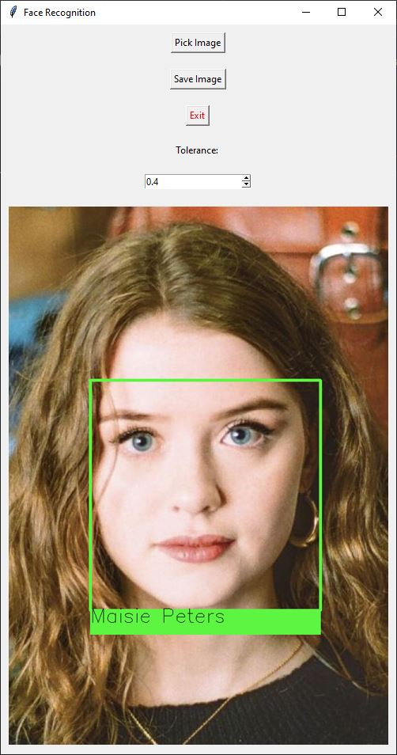
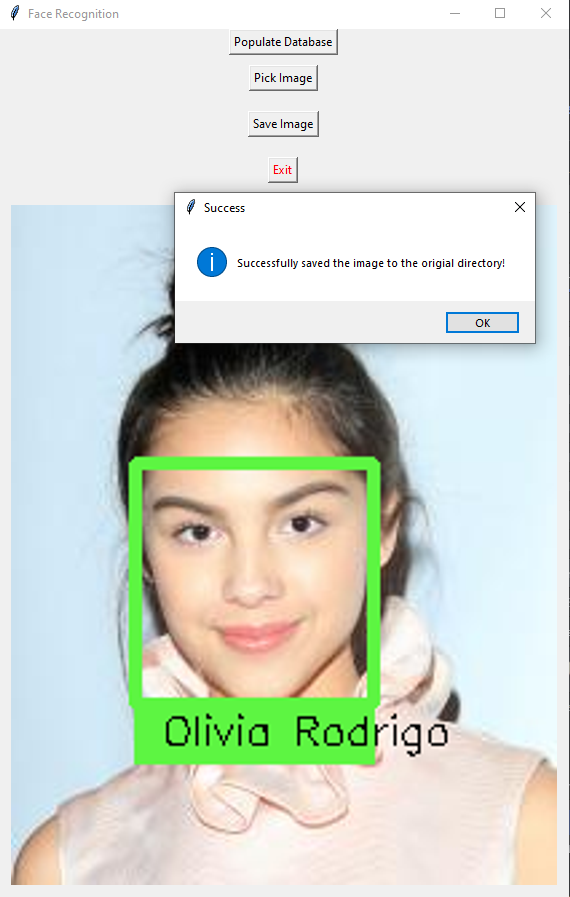

# FacialRecognition
Identify people using couple of images

FacialRecognition is an app written with [Python 3.9](https://www.python.org/) using [Tkinker](https://docs.python.org/3/library/tkinter.html), [OpenCV](https://opencv.org/) and [Face Recognition](https://github.com/ageitgey/face_recognition) modules. It lets you populate facial encoding data from couple of images and helps you identify anyone who's in the dataset.

## Features
* Easily create dataset
* Easy to use UI
* Import image right from the app
* Save identified images
* Multithreading
* Cached dataset, you only have to populate the dataset once

## Screenshots
| Populating | Identified | Save Image |
| --- | ----------- | ----------- |
|  |  |  |

## How to use

#### How to clone
```dsconfig
git clone https://github.com/omeasraf/FacialRecognition.git
```

#### How to install requirements
```dsconfig
pip3 install -r requirements.txt
```

#### How to populate dataset
```dsconfig
Step 1: Create a new directory inside Image/Known with the persons name
Step 2: Save images into the newly created directory
Step 3: Run dataset.py to generate a new dataset
```
```dsconfig
python3 dataset.py
```

#### How to populate dataset (Automatically)
```dsconfig
Step 1: Open names.py file with your favorite text editor
Step 2: Add the persons name inside the "names" list
Step 3: Save the file
Step 4: Run downloader.py to automatically download and store images
Step 5: Run dataset.py to generate a new dataset
```
```dsconfig
python3 downloader.py
python3 dataset.py
```

#### How to extract frames from a video file
```dsconfig
Step 1: Move video files to "Videos" directory
Step 2: Open "extractFrames.py" file in your favorite text editor
Step 2 (alt): Alternatively you can import "ExtractFrames" class into your own python project and create a new object
Step 3: Edit The "person_name" attribute to match the person in the video
Step 4: Run extractFrames.py file to generate a directory with all the frames from the video
```
```dsconfig
python3 extractFrames.py
```

#### How to run the program
```dsconfig
python3 main.py
```

#### Note
* Make sure to download images into the "Images/Known" directory
* Initial launch might take couple of hours, depending on the number of images you've downloaded
* Once all the images has been cached, the app should open within seconds
