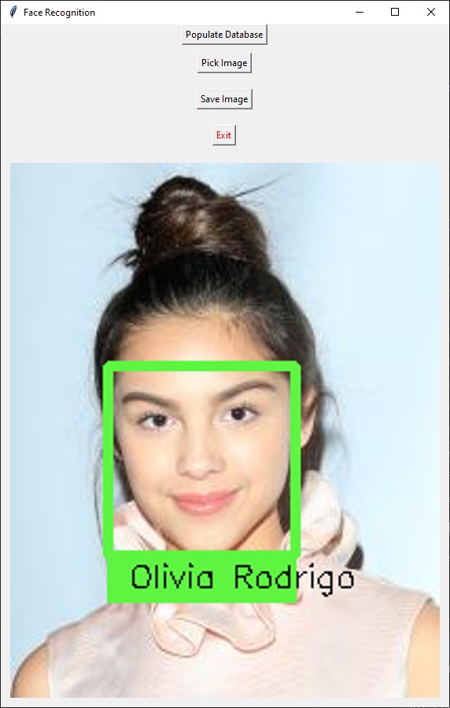

# FacialRecognition
Identify people using couple of images

FacialRecognition is an app written with [Python 3.9](https://www.python.org/) using [Tkinker](https://docs.python.org/3/library/tkinter.html), [OpenCV](https://opencv.org/) and [Face Recognition](https://github.com/ageitgey/face_recognition) modules. It helps you populate recognition data from couple of images and helps you identify anyone who's in the database.

## Features
* Easily create database
* Easy to use UI
* Import image right from the app
* Save identified images
* Multithreading
* Cached database, you only have to populate the database once

## Screenshots
| Populating | Identified | Save Image |
| --- | ----------- | ----------- |
|  |  |  |

## How to use

#### How to clone
```dsconfig
git clone https://github.com/omeasraf/FacialRecognition.git
```

#### How to install requirements
```dsconfig
pip3 -r requirements.txt
```

#### How to run the program
```dsconfig
python3 main.py
```

#### Note
* Make sure to download images into the "Images/Known" directory
* Initial launch might take couple of hours, depending on the number of images you've downloaded
* Once all the images has been cached, the app should open within seconds
